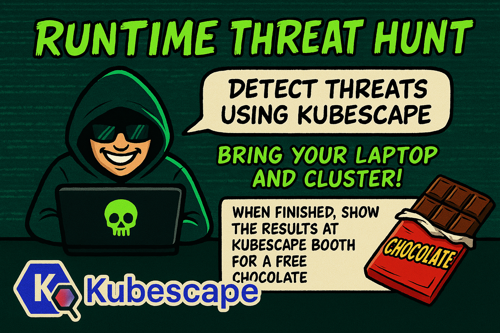
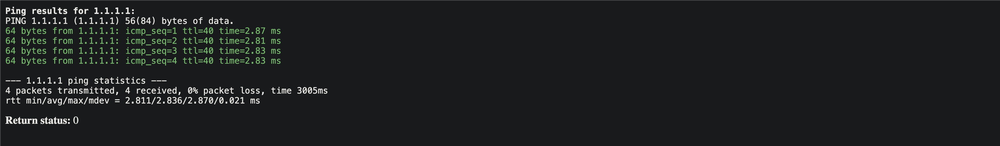
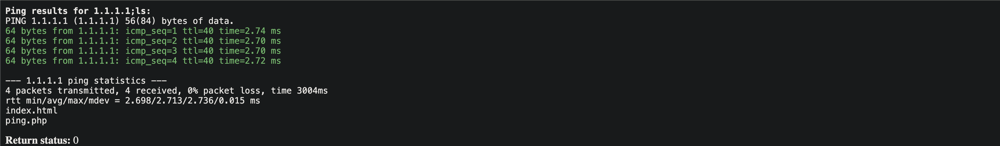

# KubeCon EU 2025 Kubescape Threat Hunt



## Prerequisites

Make sure you have the following tools installed:
- git https://git-scm.com/downloads
- kubectl https://kubernetes.io/docs/tasks/tools/install-kubectl/
- minikube https://minikube.sigs.k8s.io/docs/start/
- helm https://helm.sh/docs/intro/install

### Starting a Kubernetes cluster

```shell
minikube start
```

### Installing Kubescape

```shell
helm repo add kubescape https://kubescape.github.io/helm-charts/
helm repo update
helm upgrade --install kubescape kubescape/kubescape-operator -n kubescape --create-namespace --set clusterName=`kubectl config current-context` --set nodeAgent.config.maxLearningPeriod=15m --set nodeAgent.config.learningPeriod=2m --set nodeAgent.config.updatePeriod=1m --set capabilities.runtimeDetection=enable --set alertCRD.installDefault=true --set alertCRD.scopeClustered=true
```

### Deploying the demo application

To deploy a sample web application, run the following commands:

```shell
git clone --depth 1 https://github.com/kubescape/node-agent.git
cd node-agent
chmod +x demo/general_attack/webapp/setup.sh
./demo/general_attack/webapp/setup.sh
kubectl port-forward -n default svc/webapp 8080:80
```

This will deploy a sample web application and a service to expose it.
You can access the web application by using a web browser and going to `http://localhost:8080`.
You should see the following page:


The application is a "Ping service", it allows the user to ping a host, and it will return the output of the ping command.
Let's try to ping `1.1.1.1` and see the output.



Once you have the web application up and running, let's attack it and see how Node Agent detects the attack.

## Attack the web application

Our web application is deliberately made vulnerable to a [command injection](https://owasp.org/www-community/attacks/Command_Injection) attack.

Behind the scenes, the application is taking the IP from the form as a string and concatenates it to a command. Since there is no proper input sanitization we can use this to run arbitrary commands on the web application container and get the output.

Let's try to execute the `ls` command on the web application container.

```bash
1.1.1.1;ls
```

Great! We can see the output of the `ls` command.



## Detect the attack

Show the logs of the Node Agent and see the attack detection.

```shell
kubectl logs -f -n kubescape -l app.kubernetes.io/component=node-agent
```

You should see the following log:

```shell
{"BaseRuntimeMetadata":{"alertName":"Unexpected process launched","arguments":{"args":["/bin/ls"],"exec":"/bin/ls","retval":0},"infectedPID":1999964,"severity":5,"timestamp":"2025-04-01T15:12:11.502730963Z","trace":{}},"CloudMetadata":null,"RuleID":"R0001","RuntimeK8sDetails":{"clusterName":"kind-ben","containerName":"ping-app","hostNetwork":false,"image":"docker.io/amitschendel/ping-app:latest","imageDigest":"sha256:99fe0f297bbaeca1896219486de8d777fa46bd5b0cabe8488de77405149c524d","namespace":"default","containerID":"ac9ee8da3d976509e3b240bfcbd9208129a45673206c2bbdab07924b402d42ad","podName":"ping-app","podNamespace":"default","podLabels":{"app":"ping-app","kubescape.io/max-sniffing-time":"5m"},"workloadName":"ping-app","workloadNamespace":"default","workloadKind":"Pod"},"RuntimeProcessDetails":{"processTree":{"pid":1999964,"cmdline":"/bin/ls ","comm":"ls","ppid":1999960,"pcomm":"sh","hardlink":"/bin/ls","uid":33,"gid":33,"startTime":"0001-01-01T00:00:00Z","upperLayer":false,"cwd":"/var/www/html","path":"/bin/ls"},"containerID":"ac9ee8da3d976509e3b240bfcbd9208129a45673206c2bbdab07924b402d42ad"},"event":{"runtime":{"runtimeName":"containerd","containerId":"ac9ee8da3d976509e3b240bfcbd9208129a45673206c2bbdab07924b402d42ad","containerName":"ping-app","containerImageName":"docker.io/amitschendel/ping-app:latest","containerImageDigest":"sha256:99fe0f297bbaeca1896219486de8d777fa46bd5b0cabe8488de77405149c524d"},"k8s":{"namespace":"default","podName":"ping-app","podLabels":{"app":"ping-app","kubescape.io/max-sniffing-time":"5m"},"containerName":"ping-app","owner":{}},"timestamp":1743520331502730963,"type":"normal"},"level":"error","message":"Unexpected process launched: /bin/ls","msg":"Unexpected process launched","time":"2025-04-01T15:12:11Z"}
```
